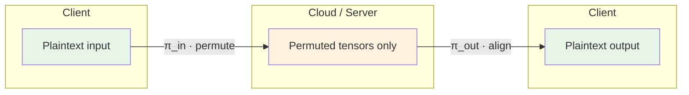
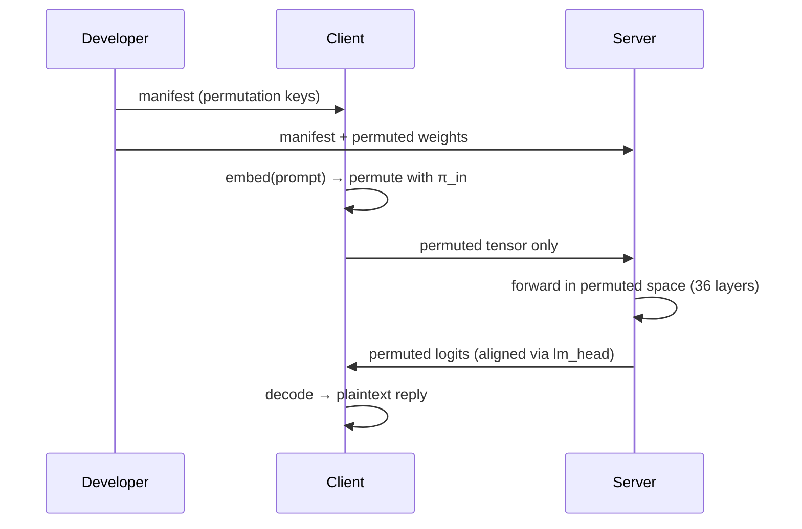
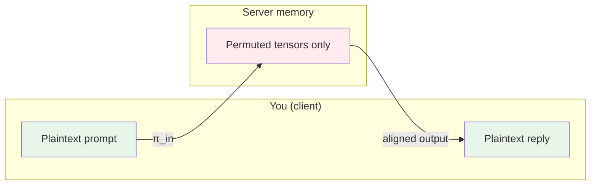
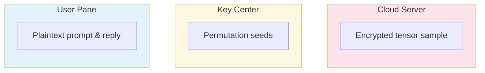

# STIP-MLX: 安全张量推断协议  
## *Secure Tensor Inference Protocol*

> **Apple Silicon–native · 8GB-friendly · Zero-knowledge inference in the cloud**

Private inference without heavy crypto: your data stays permuted on the wire and in the cloud; only you see the plaintext.

---

**Author:** Han Changshen · Founder of [NeuralZoo](https://neuralzoo.com.cn)

[](https://opensource.org/licenses/MIT)
[](https://www.python.org/downloads/)
[](https://github.com/ml-explore/mlx)
[](https://www.apple.com/mac/)

---

### Data never leaves in plain form



The server never sees your prompt or the model’s real weights—only permuted floats. You get the correct answer without exposing data or model structure.

---

## How STIP works (block-diagonal permutation on Apple Silicon)

**STIP** (Secure Tensor Inference Protocol) keeps user data and model structure private by running the whole inference in **permuted feature space**. On Apple Silicon (MLX):



1. **Block-diagonal permutation** — Each attention head uses a small permutation π on dimension $d_k$; the full hidden state is a block-diagonal perm: head 1 permuted by π₁, head 2 by π₂, … So $Q,K,V$ become $Q\pi,\,K\pi,\,V\pi$ per head. Attention scores $(Q\pi)(K\pi)^T = QK^T$ are unchanged; RMSNorm is applied with permuted γ so $\text{RMSNorm}(x\pi) = \text{RMSNorm}(x)\pi$. The server only ever sees permuted tensors and permuted weights.
2. **No heavy crypto** — No homomorphic encryption or MPC; just indexing (permutation). Inference stays standard matmul + softmax on Metal, so it runs on consumer Macs.
3. **End-to-end** — The client permutes the input embedding with π_in; the server runs 36 layers in permuted space; the output head is pre-permuted so logits are already in vocab order. One key (manifest) from the developer ties client and server together.

## Overview

- **Input blurring** — Client permutes the prompt embedding with π_in,0 before sending; observers only see meaningless floats.
- **Blind inference** — All Transformer layers run in permuted space; block-diagonal permutations preserve correctness (inner-product and rotation invariances).
- **Seamless recovery** — `lm_head` is pre-permuted at conversion time so logits are in vocabulary order; no client inverse permutation.

---

## Key features

- **Privacy-preserving blind computation** — The server only ever touches **permuted (garbled) tensors**. Your prompt and embeddings never appear in plain form in server memory or on the wire; inference is correct because block-diagonal permutations preserve inner products and norms.
- **Layer-wise continuous re-encryption** — Each layer uses its own permutation (π_in → π_out); layer $i$’s output is layer $i+1$’s permuted input. No single point in the pipeline exposes plaintext; the full chain stays private.
- **Hardware-native optimization** — Built for **M2 Mac with 8GB RAM**: conversion is **sharded by layer** (one layer at a time), and inference loads weights in **float16** from shards with an incremental KV cache so you can run the full Qwen2.5-3B STIP model on a single machine.

---

## Visual demo: what the server sees

The [web UI](https://github.com/changshenhan/STIP-MLX) has a **Cloud Server** pane that shows, in real time, the first 10 floats of the tensor the server actually receives:



| You see | Server sees |
|---------|-------------|
| Plaintext prompt, e.g. *"Hello, how are you?"* | First 10 floats of the **permuted** hidden state only |
| Meaningful text and final reply | No access to words; only meaningless numbers without the developer’s keys |

The demo UI streams this contrast live so you can verify it yourself.

---

## Why STIP matters

- **Lightweight privacy** — Unlike heavy crypto (homomorphic encryption or full secure multi-party computation), STIP uses **feature-space permutation**: the server only sees permuted tensors and never plaintext. No FHE/MPC runtime cost; inference stays in standard linear algebra.
- **Three-party fit** — Designed for the realistic setting: a **model developer** issues keys, a **server** runs the model, and a **client** owns the data. The server cannot infer user inputs or reconstruct the original weights without the developer’s permutation keys.
- **Exact correctness** — Permutations are chosen so that attention and RMSNorm remain mathematically equivalent in permuted space. The model output matches the original model; privacy does not come from approximate or noisy computation.
- **Open, runnable reference** — This repo provides an **end-to-end** implementation: conversion from HuggingFace Qwen2.5-3B, inference with KV cache, and a demo UI. It is a practical, open-source reference for permutation-based private LLM inference and for follow-on research or deployment.

## Security guarantees

**Threat model:** The server (and any observer of network or memory) sees only permuted tensors and permuted weights. Permutation keys (seeds) are generated by the **developer** and distributed to client and server; the server never sees plaintext inputs or the original weight structure.

- **Data privacy** — User input is permuted by $\pi_{\text{in}}$ before it leaves local memory. The server receives only meaningless floats and cannot recover original semantics via statistical analysis or inversion.
- **Model privacy** — Weights are statically permuted at conversion time. Even if weight files leak, an attacker cannot recover the original weight structure via chosen-plaintext attacks, because the permutation $\pi$ is derived from a **dynamically generated key** (manifest seeds) not stored in the weights.
- **Mathematical equivalence** — Inference in permuted space is exact. Block-diagonal permutations preserve inner products (attention) and row-wise norms (RMSNorm):

  $$(Q\pi)(K\pi)^T = QK^T$$

  $$\text{RMSNorm}(x\pi) = \text{RMSNorm}(x)\,\pi$$

  The model output in permuted space, after the pre-permuted `lm_head`, matches the original model’s output.

---

## Technical principles

The security of STIP rests on two **invariance** properties: attention stays correct under permutation because inner products are unchanged; normalization stays correct because we apply the same permutation to the scale (γ). So the server can run the full forward pass in permuted space and the result is **mathematically equivalent** to running on plaintext.

**1. Attention — inner-product invariance**

With block-diagonal permutation $\pi$ (one permutation per head), $Q\pi$ and $K\pi$ give the same attention scores as $Q$ and $K$:

$$(Q\pi)(K\pi)^T = Q\pi\pi^T K^T = QK^T \quad \text{(since } \pi \text{ is orthogonal)}$$

So the server can compute attention from permuted $Q,K,V$ and get the same logits (up to the same permutation on the output, which is fixed by the pre-permuted weights and $\gamma$).

**2. RMSNorm — rotation invariance**

RMSNorm is row-wise: scale depends only on the row. Permuting columns does not change the scale. If we permute the weight $\gamma$ the same way as the input, we get:

$$\text{RMSNorm}(x\pi) = \text{RMSNorm}(x)\,\pi$$

So the server can run RMSNorm in permuted space and the output is just the permuted version of what the original model would output. Together with the linear layers (whose weights are pre-permuted at conversion time), this guarantees **end-to-end mathematical equivalence** between permuted inference and plaintext inference.

---

## Requirements

- Python 3.10+
- Apple Silicon (MLX). See [MLX](https://github.com/ml-explore/mlx).

## Quick start

### 1. Environment

Clone the repo and install dependencies (MLX, Transformers, Gradio, etc.):

```bash
git clone https://github.com/changshenhan/STIP-MLX.git
cd STIP-MLX
pip install mlx transformers tqdm pandas gradio numpy huggingface_hub
```

Or install from the project’s list:

```bash
pip install -r requirements.txt
```

Download the Hugging Face Qwen2.5-3B model (safetensors):

```bash
huggingface-cli download Qwen/Qwen2.5-3B --local-dir ./qwen2.5-3b
```

Or use an existing folder that already contains `model.safetensors` (or `model-*.safetensors`) from [Qwen2.5-3B](https://huggingface.co/Qwen/Qwen2.5-3B).

### 3. Model conversion (8GB-friendly, sharded)

Conversion is **sharded by layer** so it fits in **~8GB RAM** (e.g. M2): the script processes one decoder layer at a time and writes `layer_00.safetensors` … `layer_35.safetensors` plus `non_layer_part_*.safetensors`. The full model is never held in memory at once.

From the project root:

```bash
python scripts/convert_qwen_to_stip.py ./qwen2.5-3b -o stip_model --base-seed 42
```

Replace `./qwen2.5-3b` with your path. Output: `stip_model/` with `manifest.json` and sharded weights. Share `manifest.json` with client and server.

### 4. Run the demo

Start the web UI:

```bash
python app.py --model-dir stip_model --port 7860
```

Open http://127.0.0.1:7860 in your browser. Click **Load model**, then enter a prompt and click **Run inference**.

### Three-pane demo UI

The web UI uses a **three-column layout** so you can see who sees what:



| Pane | Role | What it shows |
|------|------|----------------|
| **User** | Client / data owner | Plaintext prompt and the final assistant reply. Messages are tagged `[Encrypted]` to indicate they were produced from encrypted-state inference. |
| **Key Center** | Developer | The permutation seeds in use (e.g. `perm_in(0)`, `L0 qk/out/kv`, …). This is the “key” that both client and server use; only the developer issues it. |
| **Cloud Server** | Server | A live sample of the **encrypted** tensor (first 10 floats) that the server actually receives. You see that the server only gets meaningless numbers, not the original text or embeddings. |

A **performance** bar chart under the panes shows per-step token latency. Streaming updates all three panes as each token is generated.

By default the app uses the GPU (Metal). If you see a GPU timeout, run with `--cpu`.

### Running on 8GB M2

- **Conversion:** Use the command in step 2 above. The script loads and converts one layer at a time and writes sharded safetensors, so peak memory stays within ~8GB.
- **Inference:** Weights are loaded in **float16** and layer-by-layer from shards; KV cache is incremental. On an 8GB M2 you can run the Web UI or CLI. If Metal hits a timeout on long runs, start with `--cpu` (e.g. `python app.py --model-dir stip_model --cpu`); it is slower but stable.

## Usage

### Web UI (Gradio)

```bash
python app.py [--model-dir stip_model] [--port 7860] [--share] [--cpu]
```

- `--model-dir` — Directory containing STIP sharded weights and `manifest.json`.
- `--port` — Server port (default 7860).
- `--share` — Create a public Gradio link.
- `--cpu` — Use CPU instead of Metal (avoids GPU timeout on heavy runs).

Compatible with Gradio 4.x and 6.x (Chatbot uses `role`/`content` message format on 6.x).

### CLI inference

```bash
python main.py --model-dir stip_model --prompt "Hello, how are you?" --max-new-tokens 32
```

Options:

- `--model-dir`, `--manifest`, `--tokenizer` — Model and tokenizer paths.
- `--prompt` — Input text.
- `--max-new-tokens` — Maximum new tokens to generate (default 32).
- `--quiet` — Suppress per-step timing.
- `--cpu` — Use CPU.
- `--compile-decode` — JIT-compile decode (often slower with growing KV cache).
- `--profile` — Print per-step breakdown (forward vs logits) for the first two decode steps.

### Run tests

Use the same Python environment as for `pip install` (MLX required):

```bash
python -m pytest tests/ -v
```

## Project structure

```
STIP/
├── app.py                    # Web UI (Gradio): 3-pane view, streaming, performance chart
├── main.py                    # CLI: load model, run_inference, print output
├── scripts/
│   └── convert_qwen_to_stip.py # HuggingFace Qwen → STIP sharded weights + manifest
├── src/
│   ├── core/                  # Permutation, StipRMSNorm, PreEncryptedAttention, StipChainManager
│   ├── inference.py           # load_model, run_inference, run_inference_stream (for UI)
│   ├── model/                 # StipQwenModel (sharded weights, forward in permuted space)
│   └── roles/                 # Placeholder for three-party role logic
├── tests/
├── requirements.txt
├── LICENSE
└── README.md
```

---

## Security warning

**This version is a prototype for research and demonstration.** It has not undergone a formal security audit. **Do not use it in production or with sensitive data.** Use at your own risk.

---

## License

This project is released under the **MIT License** (MIT 开源协议). You may use, modify, and distribute it under the terms of the [LICENSE](LICENSE) file.
